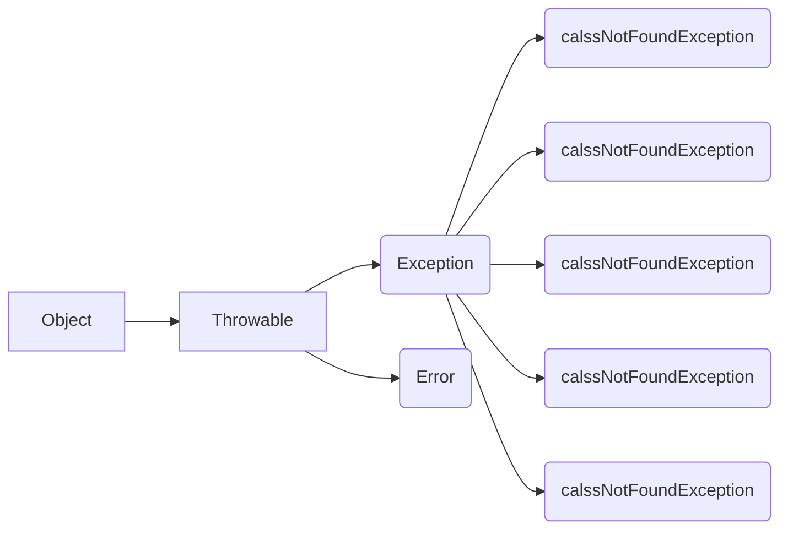

查询所有以及分类

商品名称 一二三极分类名称 

21 号用户 6号订单


```
public class Person implements Serializable {  private String name;  private int age;  //我不提供无参构造器  public Person(String name, int age) {      this.name = name;      this.age = age;  }  @Override  public String toString() {      return "Person{" +              "name='" + name + '\'' +              ", age=" + age +              '}';  }}public class WriteObject {  public static void main(String[] args) {      try (//创建一个ObjectOutputStream输出流           ObjectOutputStream oos = new ObjectOutputStream(new FileOutputStream("object.txt"))) {          //将对象序列化到文件s          Person person = new Person("9龙", 23);          oos.writeObject(person);      } catch (Exception e) {          e.printStackTrace();      }  }}复

作者：9龙
链接：https://juejin.im/post/5ce3cdc8e51d45777b1a3cdf
来源：掘金
著作权归作者所有。商业转载请联系作者获得授权，非商业转载请注明出处。
```





